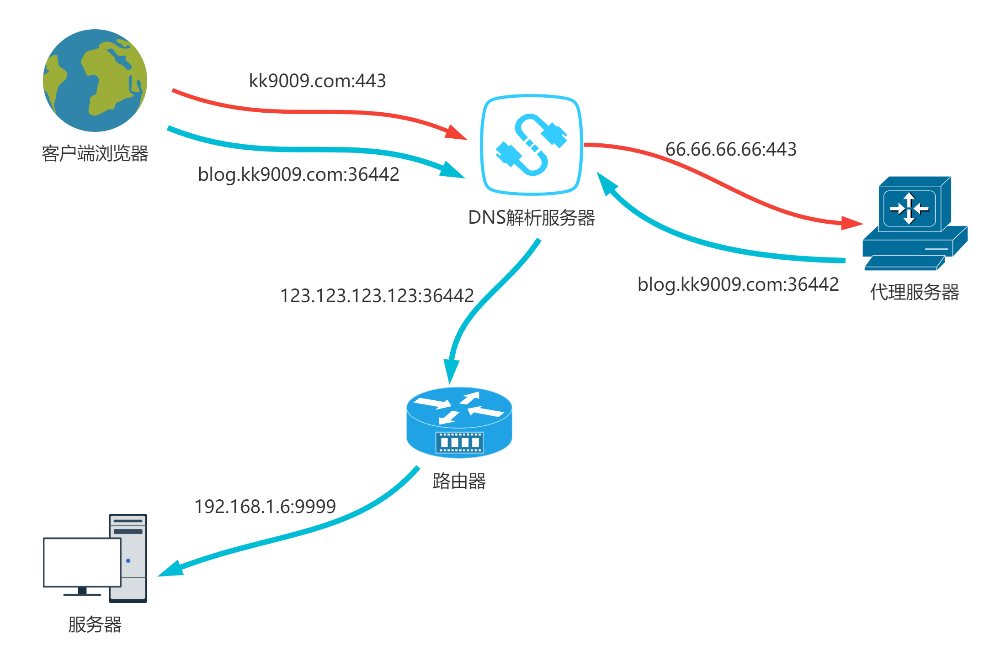

## 前言

最近打算将原来博客迁移到 VuePress 中，部署完发现外网无法访问网站。第一反应是服务器的 nginx 配置有问题，发现局域网内可以访问。进一步又怀疑是域名解析有问题，经排查也不是这个问题，后来又怀疑路由器的端口转发配置以及路由器和服务器防火墙等，最后都没发现问题。最终尝试在路由器端将入站的 443 端口修改为其他端口号后发现可以访问，此时心中飘过一匹 🐎，因为基本可以判断是运营商封禁端口号了。当然也不能完全死心，尝试了在各大在线端口扫描进行测试，发现大部分都显示 443 端口关闭，所以 😏。

所谓兵来将挡，你有张良计，我就能找到过墙梯！网上资源那么多，我遇到的 90% 的问题都能找到行之有效的解决方案。

## 解决思路

由于大环境不好，运营商封禁了很多端口号，既然这个不能用，那就换另一个嘛，又不是不能接受。那当然了，针对大多数应用这么搞没太大问题，如果是自己搭建的博客等这种需要友好的被外网访问的网站则需要进一步处理一下。

借用大佬的思想: 计算机中的大多数问题都可以通过添加一个中间层解决。既然这样就加一层来专门做代理转发吧，大致如下面的图所示。



以我网站为例，本来期望是直接通过 blog.kk9009.com 这个二级域名直接访问到服务器上部署的网站，但是由于 443 端口的封禁，我需要使用其他端口号 (例如 36442 等)才能访问。当外网中通过域名 + 端口号形式访问服务器时会首先通过 DNS 解析服务器解析出服务器所在路由的 IP 地址，然后由路由器再做一次端口转发就可以访问到服务器的资源了，这是其中一条道路。

当然了，我们可以加一个中间层，使用另外一个域名 (一二级域名均可，我这里是 kk9009.com)，在 DNS 解析服务器中配置其 IP 地址为代理服务器的地址，这样在代理服务器内部再做一次转发，将请求转发到 blog.kk9009.com:36442 这个域名对应的服务器中，这就相当于增加了一条访问通道。

## 配置过程

域名解析和路由器的端口转发依赖于运行商和路由器品牌等，这部分就不一一介绍了，自行搜索解决，我主要介绍下代理服务器和服务器里面的配置。无论是代理服务器还是家里的服务器，我的系统都是 Debian，所以下面将要介绍的配置操作均是在 Debian 系统下完成的。

### 代理服务器配置

代理服务器端选择的是 Caddy，这也是我首次尝试使用 Caddy，总体来讲，配置较 Nginx 简单，可以快速完成部署，易使用的特性很吸引我这样的懒人。

#### 安装

参考官网的安装教程: <https://caddyserver.com/docs/install#debian-ubuntu-raspbian>

```sh
sudo apt install -y debian-keyring debian-archive-keyring apt-transport-https
curl -1sLf 'https://dl.cloudsmith.io/public/caddy/stable/gpg.key' | sudo gpg --dearmor -o /usr/share/keyrings/caddy-stable-archive-keyring.gpg
curl -1sLf 'https://dl.cloudsmith.io/public/caddy/stable/debian.deb.txt' | sudo tee /etc/apt/sources.list.d/caddy-stable.list
sudo apt update
sudo apt install caddy
```

#### 编辑配置文件

:::tabs

@tab sh

```sh
sudo vim /etc/caddy/Caddyfile
```

@tab vim's content

```vim
kk9009.com {
  gzip
  timeouts none
  proxy / https://blog.kk9009.com:36442 {

  }
  tls kkisscj@gmail.com
}
```

:::

#### 启动 Caddy 服务

:::tabs
@tab 启动服务

```sh
sudo systemctl start caddy.serivce
```

@tab 重启服务

```sh
sudo systemctl restart caddy.serivce
```

@tab 停止服务

```sh
sudo systemctl stop caddy.serivce
```

@tab 查看状态

```sh
sudo systemctl status caddy.serivce
```

:::

### 服务器配置

服务器端存放了网站的资源，我自己基本都是使用 Nginx 作为服务器的。由于 Nginx 配置复杂，而且随应用的需求不同配置也有所区别，我这里只展示实现上述代理过程所需要的一些配置项。

#### 安装 Nginx

```sh
sudo apt isntall nginx
```

#### 编写配置文件

:::tabs

@tab sh

```sh
sudo vim /etc/nginx/conf.d/blog.kk9009.com.conf
```

@tab vim's content

```vim
server {
  # 服务器监听端口
  listen 9999 ssl http2;
  # 服务器地址
  server_name: blog.kk9009.com;
  # SSL 证书位置
  ssl_certificate /etc/ssl/blog.kk9009.com.crt;
  ssl_certificate_key /etc/ssl/blog.kk9009.com.key;
  # SSL 配置
  ssl_session_timeout 5m;
  ssl_ciphers ECDHE-RSA-AES128-GCM-SHA256:ECDHE:ECDH:AES:HIGH:!NULL:!aNULL:!MD5:!ADH:!RC4;
  ssl_protocols TLSv1 TLSv1.1 TLSv1.2 TLSv1.3;
  ssl_prefer_server_ciphers on;

  # 静态资源的根目录
  location / {
    root /home/blog/dist;
    inde index.html;
  }
}

```

:::

#### 启动 Nginx 服务

:::tabs
@tab 启动服务

```sh
sudo systemctl start nginx.serivce
```

@tab 重启服务

```sh
sudo systemctl restart nginx.serivce
```

@tab 停止服务

```sh
sudo systemctl stop nginx.serivce
```

@tab 查看状态

```sh
sudo systemctl status nginx.serivce
```

:::

#### 检查配置文件是否有问题

当修改了 Nginx 的配置文件后需要重新加载一下配置文件，可以先使用命令检查一下配置文件是否存在问题，如没有问题则使用命令重新加载配置文件。

:::tabs
@tab 检查配置文件

```sh
sudo nginx -t
```

@tab 重新加载配置文件

```sh
sudo nginx -s reload
```

:::
