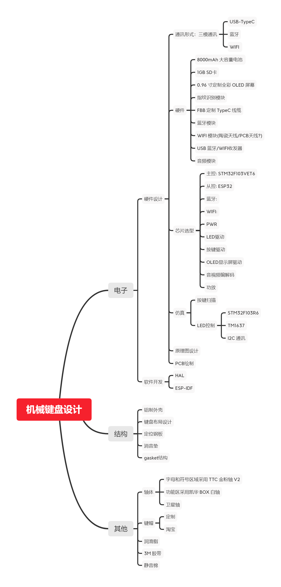

## 前言

做为一个键圈新人，一直潜水于 zFrontier、极客定制等客制化论坛，但是却苦于客制化的价格太高，迟迟没有下手，感觉花个大几千就为了买个自己组装的玩意，可玩性上似乎很亏。于是我思索很久还是决定自己做一把键盘，基本打算从硬件到软件和最终的结构设计都由自己来完成，毕竟自己喜欢瞎折腾。

目前初步的想法是做一把全铝的三模 87 配列的键盘，采用目前键圈流行的 Gasket 结构，而主控基于 STM32 和 ESP32，由于自己平时工作也不怎么接触这两款 MCU，所以基本算是从 0 开始学习。除了软硬件开发还要做外壳的结构设计，这方面自己真是纯粹的一个小白，Solidworks 的操作也还要花一段时间来学习。再加上自己平时工作上各种事情太多，有时候下班还要接着干，所以这个事情对我而言其实具有很大的挑战性，整个学习周期估计会很长很长很长，甚至最终可能都不一定能够坚持下来。还是走一步算一步吧，先给自己挖个坑，以此为专题开始记录在调研学习如何制作一把键盘的全过程。

下面这个图简单梳理了一下整个过程自己需要做的一些工作，部分功能最终可能也不会具体实现，为了节省成本，目前计划先做个小键盘作为验证。

