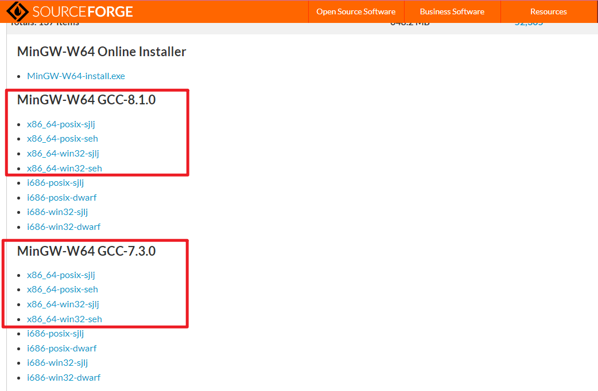
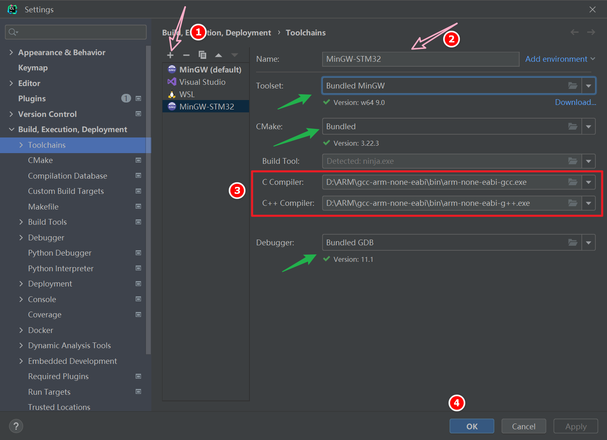
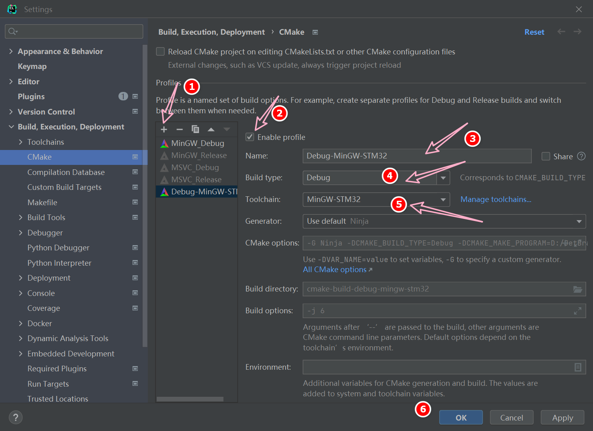

## 前言

工作中我通常都是仿真或者分析先行，验证核心功能的思路正确的情况下才会真正的开始动手。毕竟仿真分析的过程一方面是发现自己哪些知识还尚缺，另一方面也在一定程度上提供了试错的机会，在工程实践上具有很大的指导意义。

做了很长时间的开发人员，感觉无论是硬件还是软件，最烦的就是搭建环境了，但又不得不做，搭建过程中时不时还不知道什么鬼原因导致失败，真希望各大厂商能够降低搭建开发环境的复杂度，提高易用性。

## 整体安装过程

1. 安装 Proteus；
2. 安装软件开发环境(CLion, MinGW-w64, CMake, OpenOCD, STM32CubeMX, arm-none-eabi-gcc)

仿真使用的软件是 Proteus 8.9，该软件的具体安装过程就不重复写了，安装上并没有什么难度。这里抛一个简单的安装使用教程 [https://www.bilibili.com/read/cv5182620/](https://www.bilibili.com/read/cv5182620/)，安装配置过程主要参考稚晖君大佬的教程 [配置 CLion 用于 STM32 开发【优雅の嵌入式开发】](https://zhuanlan.zhihu.com/p/145801160)

### 安装 CLion

CLion 应该是我自己最喜欢的 IDE 了，我记得刚接触它的时候还特意为了这个 IDE 才去学的 CMake 语法。它虽然在功能上比宇宙第一 IDE 稍差，但是完全够我使用了。

**下载地址**：[CLion](https://www.jetbrains.com/clion/download/#section=windows)， 无脑安装即可，CLion 安装完成会自带一个默认版本的 CMake，不需要单独安装，当然也可以单独安装更新的版本，不过更新版本的 CMake 可能存在一些兼容性问题。

**破解方法**：还是惯例宣传一下希望有币之士支持正版，我自己作为一个苦逼的小开发不得已成为了一个白嫖党，感谢各大为白嫖党提供帮助的大神。扯远了，CLion 的破解可以去[知了大神](https://zhile.io/)的博客了解一下，破解过程难度并不大，仔细仔细仔细阅读教程即可。

### 安装 MingGW-w64

:::tip
更新：最新版本的 CLion 已经自带 MinGW，版本为 MinGW-w64 9.0。详见 [Bundled MinGW](https://www.jetbrains.com/help/clion/quick-tutorial-on-configuring-clion-on-windows.html#MinGW)
:::

家里面的操作系统是 Windows，不想搞个虚拟机，也不是很想用 WSL，如果真的需要 Linux 系统会直接使用另一个电脑的 Debian 系统，MSVC 最让我不舒服的要改文件编码格式，所以我选 MingGW。

[MingGW-w64](https://www.mingw-w64.org/) 的安装教程可以参考 [MingGW-w64 安装教程](https://zhuanlan.zhihu.com/p/76613134)，如果你不会魔法上网，按照教程操作大概率会下载失败或者没有进度，这时候就可以考虑手动下载离线安装版了。

点击 [mingw-w64-release](https://sourceforge.net/projects/mingw-w64/files/mingw-w64/mingw-w64-release/) 跳转到 Release 下载地址，往下拖动网页直到看到各个离线的版本 (如下图)，选择自己需要的版本下载后按照上面的教程配置环境变量即可。

### 安装 OpenOCD

**下载地址**: [OpenOCD](https://gnutoolchains.com/arm-eabi/openocd/)，需配置环境变量

### 安装 STM32CubeMX

**下载地址**: [STM32CubeMX](https://www.st.com/en/development-tools/stm32cubemx.html)

### 安装 arm-none-eabi-gcc

**下载地址**: [arm-none-eabi-gcc](https://developer.arm.com/downloads/-/gnu-rm)，需配置环境变量

## 在 CLion 中配置 STM32 的开发环境

### 配置工具链

工具链配置如下图所示，其中第 3 步根据自己配置的环境变量修改，其他绿色箭头标注的地方建议直接使用自动识别的即可。

### 配置 CMake

