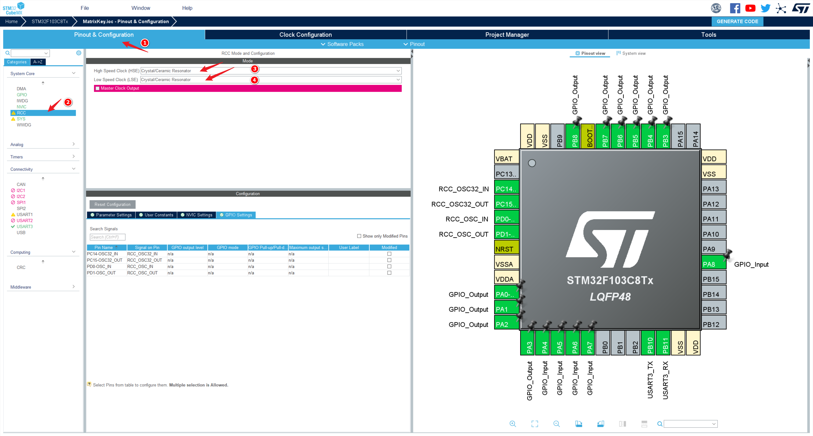

## 仿真结果


## 创建 Proteus 工程

### 新建工程

新建工程的大部分过程可以直接使用默认选项，但是需要在指定创建何种类型的 Project 时选择 Firmware Project，然后选择自己想使用的内核、芯片。具体配置如下图，编译器可不选择，因为我不用 Proteus 编译代码。


### 绘制原理图

Proteus 中仿真跟实际差别应该还挺大的，原理图设计在保证能够验证核心功能的情况下尽可能简单，否者可能出现理解不了的仿真结果，比如我想通过添加二极管给按键做无冲处理，但是 STM32 的 GPIO 口却因此无法检测外部输入的电平变化，而测量输入电压变化又是正确的，很令人费解。

仿真原理图如下，矩阵式按键设计。行线对应 GPIO 口的 PA0 ~ PA3，推挽输出模式； 列线对应 GPIO 口的 PA4 ~ PA8，浮空输入模式。输出使用 GPIO 口的 PB3 ~ PB8，分别对应一个 LED 控制，其中 PB8 连接的 LED 用于指示系统工作状态，其他几个 IO 口通过 NMOS 管连接的 LED 用于表示按键对应数值的二进制表示形式，1 为亮，0 为灭。为了更好的观察调试信息，我还接了一个虚拟的串口终端。


我选择的 STM32F103C8 芯片需要额外配置 VDDA/VSSA 的连接才能正常仿真，这里有两种解决办法。

第一种是直接进行配置，选择 "Design->Configure Power Rails"，会打开电源配置窗口，将 VDDA 添加到 VCC 网表中，将 VSSA 添加 GND 网表中。如下图所示：

:::center


:::

第二种方法是在原理图中给 VDDA/VSSA 添加网络标号，如下图所示：

:::center


:::

:::tip

芯片建议选择 Flash 容量稍大的，我使用串口打印调试信息，即使开了 Os 优化，最终生成的代码大小也已经超过了一些小容量的芯片。

:::

## 使用 CLion 开发 STM32

使用 CLion 创建一个 STM32CubeMX 的工程后会生成一个 .ioc 结尾的文件，点击该文件可以选择以 STM32CubeMX 打开，默认情况下的芯片并不是我们期望的，所以需要重新选择芯片。

### 配置引脚




### 配置时钟


### 配置项目


### 编辑代码

```c
// 为了省事，所有测试代码的实现直接写在了头文件
//
// Created by KK on 2022/7/2.
//

#ifndef MATRIXKEY_BINARY_KEY_LED_H
#define MATRIXKEY_BINARY_KEY_LED_H

#include "stm32f1xx_hal_gpio.h"

const uint8_t RowCounts = 4, ColCounts = 5;
const uint8_t NumberBits = 5;
const uint16_t NotValid = 0xffff;
uint16_t pinRows[4] = {GPIO_PIN_0, GPIO_PIN_1, GPIO_PIN_2, GPIO_PIN_3};
uint16_t pinCols[5] = {GPIO_PIN_4, GPIO_PIN_5, GPIO_PIN_6, GPIO_PIN_7,
                       GPIO_PIN_8};
uint16_t pinLed[5] = {GPIO_PIN_3, GPIO_PIN_4, GPIO_PIN_5, GPIO_PIN_6,
                      GPIO_PIN_7};
/**
 * @details 仿真没加按键防冲，只检测单键按下
 * @return 返回被按下的键所在列的索引，从 0 开始
 */
uint16_t find_key_col() {
  for (int i = 0; i < ColCounts; ++i) {
    if (HAL_GPIO_ReadPin(GPIOA, pinCols[i]))
      return i;
  }
  return NotValid;
}

/**
 * @details 等待按键释放
 * @param pinColIndex 按键所在列的索引，从 0 开始, 0xffff 表示没有找到对应的列
 */
void wait_key_release(uint16_t pinColIndex) {
  while (HAL_GPIO_ReadPin(GPIOA, pinCols[pinColIndex]));
}

/**
 * @details 查找行
 * @return 返回被按下的键所在行的索引，从 0 开始, 0xffff 表示没有找到对应的行
 */
uint16_t find_key_row(uint16_t pinColIndex) {
  for (int i = 0; i < RowCounts; ++i) {
    // 将行输出拉低，判断列输入电平是否变化，判断后必须将行输出拉高以恢复状态
    HAL_GPIO_WritePin(GPIOA, pinRows[i], GPIO_PIN_RESET);
    int state = HAL_GPIO_ReadPin(GPIOA, pinCols[pinColIndex]);
    HAL_GPIO_WritePin(GPIOA, pinRows[i], GPIO_PIN_SET);
    if (!state) return i;
  }
  return NotValid;
}

/**
 * @details 关闭所有 LED
 */
void led_off() {
  uint16_t pin = 0;
  for (int i = 0; i < NumberBits; ++i)
    pin |= pinLed[i];
  HAL_GPIO_WritePin(GPIOB, pin, GPIO_PIN_RESET);
}

/**
 * @details 打开 LED
 * @param pinRowIndex 按键所在的行索引
 * @param pinColIndex 按键所在的列索引
 */
void led_on(uint16_t pinRowIndex, uint16_t pinColIndex) {
  uint16_t num = pinRowIndex * ColCounts + pinColIndex + 1;
  uint16_t pinOn = 0, pinOff = 0;
  for (int i = 0; i < NumberBits; ++i) {
    num & 1 ? (pinOn |= pinLed[i]) : (pinOff |= pinLed[i]);
    num >>= 1;
  }
  HAL_GPIO_WritePin(GPIOB, pinOn, GPIO_PIN_SET);
  HAL_GPIO_WritePin(GPIOB, pinOff, GPIO_PIN_RESET);
}

#endif // MATRIXKEY_BINARY_KEY_LED_H
```

```c
// main.c 中部分代码

HAL_GPIO_WritePin(GPIOB, GPIO_PIN_8, GPIO_PIN_SET);
/* USER CODE END 2 */

/* Infinite loop */
/* USER CODE BEGIN WHILE */
while (1) {
  /* USER CODE END WHILE */
  uint16_t col = find_key_col();
  if (col == NotValid)
    continue;
  uint16_t row = find_key_row(col);
  if (row == NotValid)
    continue;
  wait_key_release(col);
  printf("pressed number: %d\r\n", row * ColCounts + col + 1);
//    led_off();
  led_on(row, col);
  /* USER CODE BEGIN 3 */
}
/* USER CODE END 3 */

```

### 配置生成的 hex 文件

在 Proteus 仿真中指定由 CLion 生成的 hex 文件，同时指定频率为 72 MHz，这个频率可以保证后面使用串口接收数据的正确性。

:::center


:::

串口的波特率、数据位、校验、停止位等参数参考前面 STM32CubeMX 配置的串口参数即可

:::center


:::
