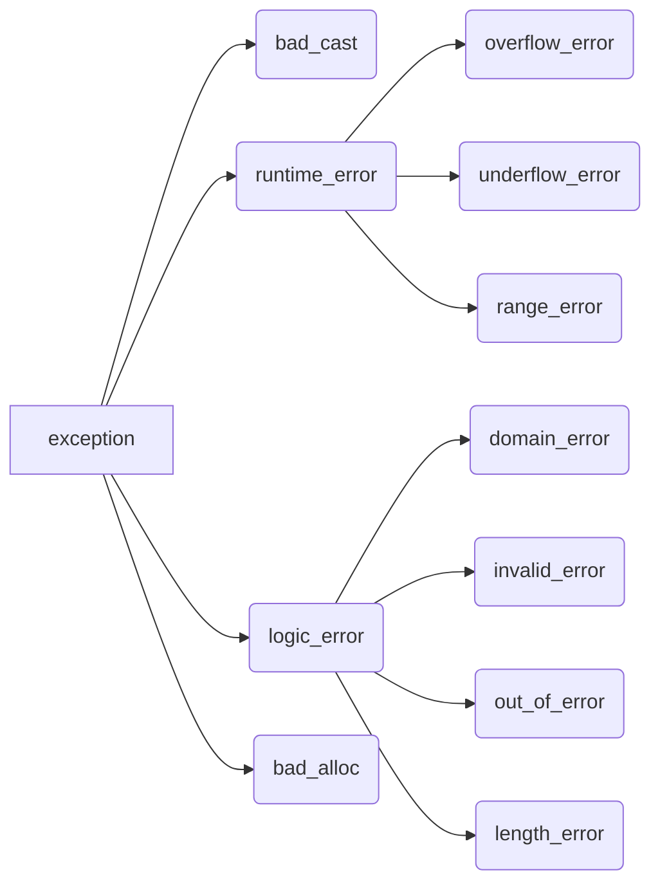

## 18.1 异常处理

### 18.1.1 抛出异常

_throw_ 可以引发一个异常，使用 _try…catch_ 可以捕获异常。当执行 _throw_ 时，后面的语句将不会被执行，此外，系统会利用 "**==栈展开==**" 的方式逐级查找与之匹配的最近的 _catch_ 块，首先尝试在抛出异常的被调函数中查找是否有匹配的 _catch_，如果没有找到则去主调函数找，在主调函数还没找到就这接着去主调函数的主调函数找，如此层层展开。如果最终都没找到会调用 _terminate_ 结束程序运行。

在栈展开的过程中，对于已经创建的局部对象，离开其作用域时同样会自动销毁，如果创建的局部对象是类对象，那么会调用类的析构函数。如果异常发生在构造函数中，可能某些对象成员已经完成了初始化，而另一部分尚未完成，那么则必须保证这些已经完成的对象能够正确的销毁。

类的析构函数总是会被执行，因此使用类来控制资源的分配，就能够确保无论函数正常结束或者遭遇异常，资源都能够被正常释放。如果异常发生却没有被捕获，那么程序将结束运行，因此在栈展开的过程中析构函数中如果发生了异常，那么必须保证在析构函数内部完成处理。

异常对象是一种特殊的对象，编译器使用异常抛出表达式对异常对象进行拷贝初始化。如果表达式是类类型，那么相应的类的析构函数和拷贝或者移动构造函数必须是可访问的，如果表达式是数组或函数类型，那么表达式将被转换成与之对应的指针类型。

异常对象位于编译器管理的空间中，编译器保证无论哪个 _catch_ 子句都能访问这个空间，异常处理完毕后，异常对象被销毁。

抛出异常的表达式不能是局部对象，而且表达式的静态编译类型决定了异常对象的类型，如果异常对象是指向派生类对象的基类指针将会被切掉一部分，只有基类被抛出。

### 18.1.2 捕获异常

_catch_ 子句中的异常声明类型决定了能捕获的异常类型，这个类型必须是完全类型，可以左值引用，但是不能是右值引用，如果 _catch_ 不需要访问抛出的表达式的话，可以忽略捕获形参的名字，但是捕获的异常类型不能忽略。

```cpp
// 异常捕获，其中e是捕获形参的名字，
// 如果不需要访问抛出的表达式可以忽略，而excepion是捕获的异常类型。
try{...}
catch(excepion e){ cout << e.what() << endl;}
```

捕获异常形参与函数形参类似，形参类型是非引用类型，那么会对异常对象进行拷贝，那么更进一步地，当异常对象是指向派生类对象的基类指针时，将只会复制异常对象的基类部分。如果是引用类型，那么会将引用绑定到异常对象。

> 异常声明的静态类型决定了 catch 语句的所执行的操作，如果 catch 语句接收的异常与某个继承体系有关，最好将形参类型定义为引用。

在栈展开的过程中，找到的第一个匹配的 _catch_ 子句可能不是最佳匹配，因此对于更特例化的 _catch_ 应该放置在最接近异常抛出的地方。

异常与 _catch_ 异常声明的匹配规则有较多的限制，除了一些极小的差别之外，要求异常的类型和 _catch_ 声明的类型是精确匹配的，以下是允许的细微差别：

- 非 _const_ 异常对象可以被 _catch_ 中的 _const_ 对象的捕获
- 允许派生类向基类的转换
- 数组和函数被转换成指针

==当一个异常被捕获后可以通过 _throw_ 重新抛出，只是该 _throw_ 语句后面不再包含任何表达式。空的 _throw_ 语句只能出现在 _catch_ 语句块或者 _catch_ 语句块直接或间接调用的函数之外，否则程序将直接调用 _terminate_。一个空的 throw 并不产生新的异常，而是将原有异常再次抛出。==

某些情况下，并不清晰的知道需要捕获的异常类型，这时候可以直接捕获全部异常，在 _catch_ 的形参中使用…(形如 _catch(…)_ )可以捕获所有异常，捕获所有异常通常与重新抛出异常配合使用。_catch(…)_ 既可以单独出现，也可以和其他 _catch_ 语句一起出现，当一起出现的时候，_catch(…)_ 必须位于所有 _catch_ 之后。

### 18.1.3 函数 try 语句块与构造函数

程序在任何时候都可能发生异常，当异常发生在构造函数处理初始值的过程中时，位于构造函数体内的异常捕获并不能捕获初始化的错误，因为此时异常捕获并未执行。==因此，要想捕获构造函数处理初始值的异常必须将构造函数写成函数 _try_ 语句块(也称之为函数测试块)的形式==。函数 _try_ 语句块可以处理构造函数体、析构函数体、构造函数的初始化过程、析构函数的析构过程。

```cpp
// try必须出现在构造函数初始化列表的冒号之前
template<typename T>
Blob<T>::Blob(std::initializer_list<T> il) try: {
  ...
} catch(...) {
  ...
}
```

> 在使用实参初始化构造函数的形参的时候也可能发生异常，这种异常使用函数 try 语句块并不能处理。如果发生了这样的异常，应该在调用构造函数的语句块中进行处理。

### 18.1.4 noexcept 异常说明

编译器知道某个函数不会抛出异常有助于简化调用该函数的代码，甚至可以执行某些特殊的优化操作。在 C++11 以后可以使用 _noexcept_ 关键字声明其不会抛出异常，_noexcept_ 必须同时出现在声明和定义中，位于尾置返回之前，如果是类的成员函数，位于 _const_ 及引用限定符(&,&&) 之后，在 _final_、_override_ 或者 "虚函数=0" 之前。

编译器并不在编译器检查 _noexcept_ 声明，如果一个函数声明了 _noexcept_，但是使用 throw 抛出了异常，那么程序仍然会调用 _terminate_ 终止程序，这从侧面表达了我已经终止了程序，当然没有抛出异常来。因此 _noexcept_ 可以用于两种情况:

1. 确定函数不会抛出异常
2. 不知道如何处理异常，直接终止程序

_noexcept_ 有两层含义，当用作函数参数列表后面时是异常声明符，当作为异常声明符的 _bool_ 实参时，它是一个运算符。

_noexcept_ 声明符接受一个可选的 _bool_ 类型实参,实参为 _true_ 时，那么声明不会抛出异常，否则可能抛出异常。

_noexcept_ 运算符是一个一元运算符，返回 _bool_ 类型的右值常量表达式，类似于类型推断 _decltype_。

```cpp
void g();
// 作为运算符，判断给定的表达式是否抛出异常
noexcept(g())
// 可以声明一个函数f，其是否抛出异常由函数g决定，
// 第一个noexcept是声明符，接受bool类型的实参
// 第二个noexcept是运算符，根据函数g的类型判断应该返回true或者false
void f() noexcept(noexcept(g()))
```

对于函数指针及其指向的函数必须具备一致的异常说明，如果为某个函数指针声明了不抛出异常，那么该函数指针就不能指向可能抛出异常的函数。

如果基类的虚函数声明了不抛出异常，那么其派生类的虚函数同样需要声明不抛出异常。

对于拷贝控制成员，如果所有的成员和基类的所有操作都承诺了不抛出异常，那么合成的成员也不抛出异常。相反，则可能抛出异常。

### 18.1.5 异常类层次

标准库异常的继承体系：



_exception_、_bad_cast_、_bad_alloc_ 定义了默认的构造函数，_runtime_error_、_logic_error_ 没有默认的构造函数，但是定义了一个可接受 C 风格字符串或者标准库 _string_ 类型实参的构造函数。这些类都包含了一个虚函数成员 _what_，返回用于初始化异常对象的信息。标准库类可以被继承，用于自定义自己的类。

```cpp
class MismatchError : public std::logic_error{
public:
  explicit MismatchError(const std::string &s): std::logic_error(s){}
};
```

> 继承类的层次越低，表示的异常情况就越特殊，当需要 catch 这类异常时就需要将 catch 语句放在离异常最近的匹配位置。

## 18.2 命名空间

### 18.2.1 命名空间定义

"**命名空间**" 是一个作用域，分割了全局命名空间，为防止全局名称污染提供了更加可控的机制。命名空间的定义包含两部分：关键字 _namespace_,以及命名空间的名字，命名空间由花括号包含的范围形成一个作用域。其可以定义在全局作用域，也可以定义在其他命名空间中，但是不能定义在函数或者类的内部。

> 注意：与类的定义不同，命名空间的花括号后不需要分号。

命名空间可以是不连续的，在定义时，如果某个命名空间尚未存在，那么就会创建一个命名空间，同时添加成员；否则，定义命名空间的语句会被解析为打开命名空间，同时为已有的命名空间添加新的成员。

通常不会把 _#include_ 语句放在命名空间内部，因为这样操作相当于将*#include*的头文件内所有成员定义为该命名空间的成员。命名空间对于名字的声明必须在作用域内，而该名字的定义必须要明确指出其所属的命名空间。

全局作用域中定义的名字被隐式的添加到全局命名空间中，因为全局作用域是隐式的，因此它并没有名字，使用形式是 _::member_name_

值得注意的是命名空间可以嵌套定义，而 C++11 引入了一种新的嵌套命名空间，称为 "**内联命名空间**"。内联的命名空间中的名字可被外层命名空间直接使用,也就是说通过外层命名空间的名字可以直接访问内层命名空间内的成员，而不需要通过内层命名空间的名字去访问内层命名空间内的成员。

```cpp
// inline必须出现命名空间第一次定义的地方，后续打开命名空间的时候可加可不加
namespace hello{
  inline namespace hi{
    void f();
  }
}

// 在内部的命名空间被定义为inline的，其内部成员可以直接被外层的hello命名空间访问
// 非内联命名空间则必须使用hello::hi::f()进行访问
hello::f();
```

==对一个命名空间也可能没有名字，表示该命名空间内的成员具有静态生存周期，当程序结束时才会被销毁。==与其他命名空间不同的是，**未命名的命名空间仅在当前文件内部有效，其作用范围不会横跨多个不同的文件**。换言之，如果两个文件都含有未命名的命名空间，那么这两个命名空间相互无关，如果在头文件中定义了未命名的命名空间，而该头文件被多个文件引用后将会在各自引用的文件中产生不同的实体。

定义在未命名的命名空间中的名字可以被直接使用，未命名的命名空间中名字的作用域与定义未命名的命名空间的作用域一致。如果未命名的命名空间定义在文件的最外层作用域，那么该命名空间内的成员具有文件作用域。==通常使用未命名空间替代 _static_ 声明文件作用域的成员。==

### 18.2.2 使用命名空间成员

命名空间可以定义别名，但是不能通过 _using_ 和 _typedef_ 定义，命名空间的别名定义通过 _namespace_ 定义。

通过 "_using_ 声明" 可以一次只引入命名空间的一个成员，一条 _using_ 声明可以出现在全局作用域、局部作用域、命名空间作用域以及类的作用域，在类的作用域中，声明只能指向基类成员。

通过 "_using_ 指示" 可以引入命名空间的全部成员，_using_ 指示以关键字 _using_ 开始，后面是关键字 _namespace_ 以及命名空间的名字。_using_ 指示可以出现在全局作用域、局部作用域、命名空间作用域，但是不能出现在类作用域中。

"_using_ 声明" 与 "_using_ 指示" 具有两种完全不同的作用域，"_using_ 声明" 的作用域与其声明的语句本身的作用域一致；而 "_using_ 指示" 则会将命名空间内部成员的作用域提升为了命名空间定义时的作用域范围及其指示语句的作用域范围。

```cpp
// namespace
namespace A {
  int i,j;
}
// namespace
namespace B {
  int m;
}
int i = 10;
void func(){
  // using声明
  using B::m;
  m = 42; // 正确
  // using指示，在函数内部可以直接使用命名空间内部的i和j
  using namespace A;
  j = 5; // 正确；
  // 错误，因为在func函数外部的全局作用域中也定义了一个变量i，
  //而命名空间A中也有一个变量i，那么就会产生二义性错误
  i = 5;
}
```

> "_using_ 指示" 可能导致全局命名空间污染，也可能导致二义性错误。为了减少错误，应该只在头文件中的函数或者命名空间中使用 "_using_ 指示" 或者 "_using_ 声明"。

### 18.2.3 类、命名空间与作用域

对类、命名空间的查找规则遵循常规的查找规则：优先在最近的作用域中查找，如果未找到则会由内向外依次查找每个外层作用域。

> 对于查找规则有一个例外：当我们给函数传递一个类类型的对象时，除了在常规的作用域查找还会查找实参所属类的命名空间。

当一个类声明友元时，该友元并不能被外层的命名空间直接访问，这是因为友元声明仅仅声明了其访问权限，与实际的函数声明或者类声明有所不同，要想通过外层的命名空间直接访问友元，还需在外层的命名空间中进行重新声明。_不过特别的是，当友元声明中第一次出现了未声明的类类型或者函数的时候，那么该友元声明会被认为是最近的外层作用域空间的成员。_

```cpp
namespace A{
  class B {
    // 该函数不能在外部通过func1()调用，需要在外部重新声明
    friend void func1();
    // 该函数能在外部通过func2(obj_B)调用
    friend void func2(const B &);
  };
}
```

### 18.2.4 重载与命名空间

对于接受类类型实参的函数来说，其名字查找会在实参类所属的命名空间中查找，那么在函数匹配的搜索过程中也会在每个实参类及实参类的基类所属的命名空间中搜索候选函数。

```cpp
namespace A{
  class Quote{};
  void display(const Quote &){}
}
class Bulk_item : public A::Quote {};
int main() {
  Bulk_item book;
  // 名字的查找会在Bulk_item、Quote、命名空间A以及main函数所在的全局作用域中进行查找
  display(book);
  return 0;
}
```

_using_ 声明语句声明的名字，而不是函数，因此一个 _using_ 声明会将同名的所有重载函数全部引入到新的作用域中，==如果 _using_ 声明出现在局部作用域中会隐藏其外部的同名函数==。如果新的作用域中已经有一个完全相同的参数列表，那么 _using_ 将会引入错误，否则，新的引入的全部重载函数会被作为已有名字的其他重载函数加入到候选函数中。

_using_ 指示会提升命名空间成员的作用域到外部，如果命名空间的某个函数与该命名空间所属作用域的函数相同，那么命名空间中的函数也将被添加到候选函数中，但是如果外部存在于命名空间参数列表完全一致的函数，并不会导致错误，只需指明调用的是命名空间中的函数版本还是外部的函数版本即可。如果具有多个 _using_ 指示，那么每个命名空间的同名函数都会成为候选函数。

```cpp
namespace A {
void print() {}

void print(const std::string &) {}
}
namespace B {
void print(int) {}

void print(double) {}
}

void print(int) {}

// using声明的A如果在main函数内部将会隐藏全局作用域的同名函数
using A::print;
using namespace B;

int main() {
  print(); // A::print()
  print("hello"); // A::print(const std::string &)
  print(3.14); // B::print(double)
  B::print(5); // B::print(int)
  ::print(10); // ::print(int)
  return 0;
}
```

## 18.3 多重继承与虚继承

### 18.3.1 多重继承

多重继承是指从多个直接基类中产生派生类的能力，其派生类继承了所有基类的属性。每个基类包含一个可选的访问说明符，如果省略了，那么 _class_ 对应的就是 _private_ 而 _struct_ 对应的就是 _public_。

构造一个派生类对象的同时会构造并初始化它的所有基类子对象。基类的构造顺序与派生类列表中基类的出现顺序保持一致。

C++以后允许派生类从它的一个或者几个基类中继承构造函数，但是如果一个派生类从它的基类继承了相同的构造函数，那么派生类中必须为这个相同的构造函数提供自己的版本，否则将会出错。

只有当派生类使用的是合成版本的拷贝、移动和赋值成员时，才会自动对其基类部分执行拷贝、移动和赋值操作，每个基类使用自己的对应成员隐式的完成构造、赋值和销毁操作。

### 18.3.2 类型转换与多个基类

与单继承类似，可以将派生类对象绑定到基类的指针或者引用上，如果在函数调用过程中存在同时向多个基类转换的时候，那么编译器认为这两个转换一样好。此外，对象、指针和引用的静态类型决定了能够使用哪些成员。

### 18.3.3 多重继承下的类作用域

在多重继承的情况下，名字查找过程与单继承基本一致，不过需要注意的是名字查找会同时在所有基类中进行，如果多个名字在基类中都被找到，那么不加前缀限定符的情况下直接使用名字都会造成二义性。

派生类继承两个相同名字函数造成的二义性是比较明显的，但是在某些情况下派生类继承的两个函数形参列表不同也可能发生错误；此外，即使函数在某个基类中是私有的，在另外的基类中是公有的或者受保护的也可能会发生错误。要很好的解决派生类的二义性问题就是在派生类中定义一个同名的函数，使用派生类的函数版本对其基类中的函数版本进行隐藏。

### 18.3.4 虚继承

在多继承的情况下，同一个直接基类只能出现一次，但是实际上却可以通过间接继承多次继承同一个类，比如两个直接基类分别继承自同一个间接基类。

在默认情况下，一个派生类多次继承某个类，那么派生类中将包含该类的多个子对象。这种情况通常不是我们所期望的，因此 C++提供了 "**==虚继承==**" 机制来保证在多次继承的时候派生类中只包含唯一共享的虚基类子对象。==虚继承的目的是让某个类做出声明，承诺其愿意共享它的基类，共享的基类子对象称为虚基类。==

虚基类的定义方式是在派生类列表中使用 _virtual_ 关键字。

在虚继承情况下，派生类中共享基类的子对象如果同时被多于一个的直接基类所隐藏，那么在派生类中就必须重新进行定义。例如基类 A 有两个派生类 B1，B2，类 C 通过虚继承的方式继承了 B1,，B2，在这种情况下，如果 B1，B2 中都隐藏了 A 中某个成员，那么在 C 中就必须重新定义与 B1，B2 隐藏的 A 成员同名的成员，以防止产生二义性。

### 18.3.5 构造函数与虚继承

在虚派生中，虚基类是由最低层的派生类控制其初始化过程。如果按照单继承的规则，每个类各自控制着自己继承的基类进行初始化，那么当多继承的时候，虚基类会被其多个派生类重复初始化，因此对于虚基类的初始化通常是由最低层的派生类控制器初始化过程。例如虚基类 A 有两个派生类 B1，B2，类 C 通过虚继承的方式继承了 B1,，B2，那么在这种继承体系下，创建类 C 的对象时，类 C 是最低层的派生类，将由其控制类 A 的初始化过程，如果创建是 B1 或者 B2 的对象，那么 B1 或者 B2 就是最低层的派生类，将由 B1 或者 B2 控制类 A 的初始化过程。

与一般继承体系的构造函数的顺序相同，总是基类的构造函数先被调用，然后才是派生类的构造函数，但是不同的是，虚基类的初始化使用的是最低层的类的构造函数初始值列表中提供的初始值构造虚基类的成员部分，如果最低层的类没有显式初始化虚基类，那么将通过虚基类的默认构造函数执行初始化，如果虚基类没有默认的构造函数，那么将会出错。

> 虚基类总是优先于非虚基类的构造，这与他们在继承体系中的次序和位置无关。

一个类可以有多个虚基类，这些虚基类按照它们在派生类列表中出现的次序按照从左向右的顺序依次构造。
